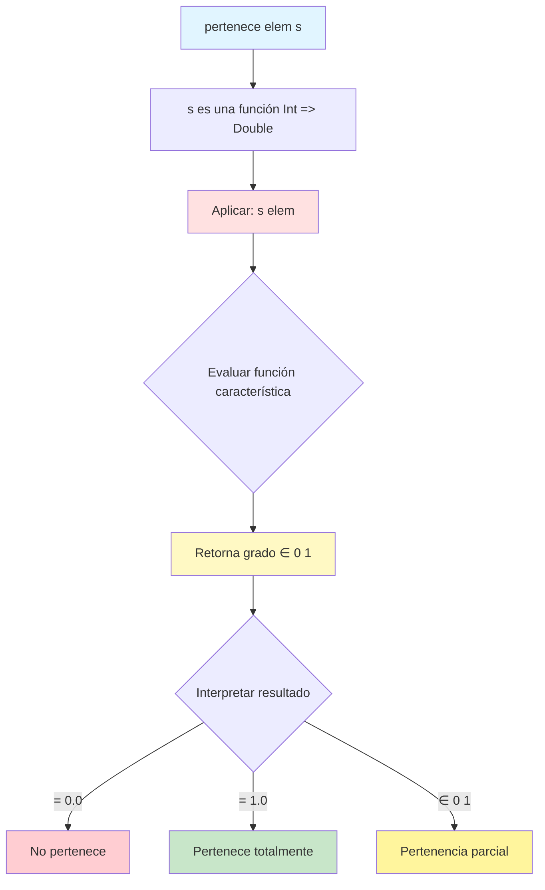
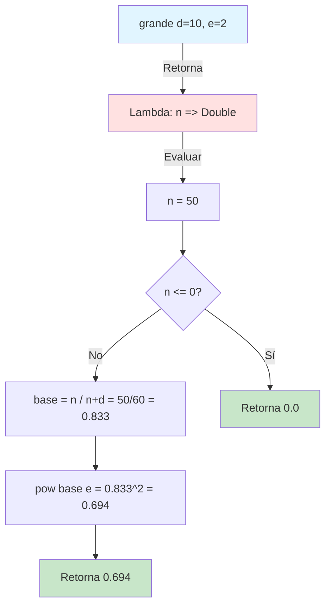
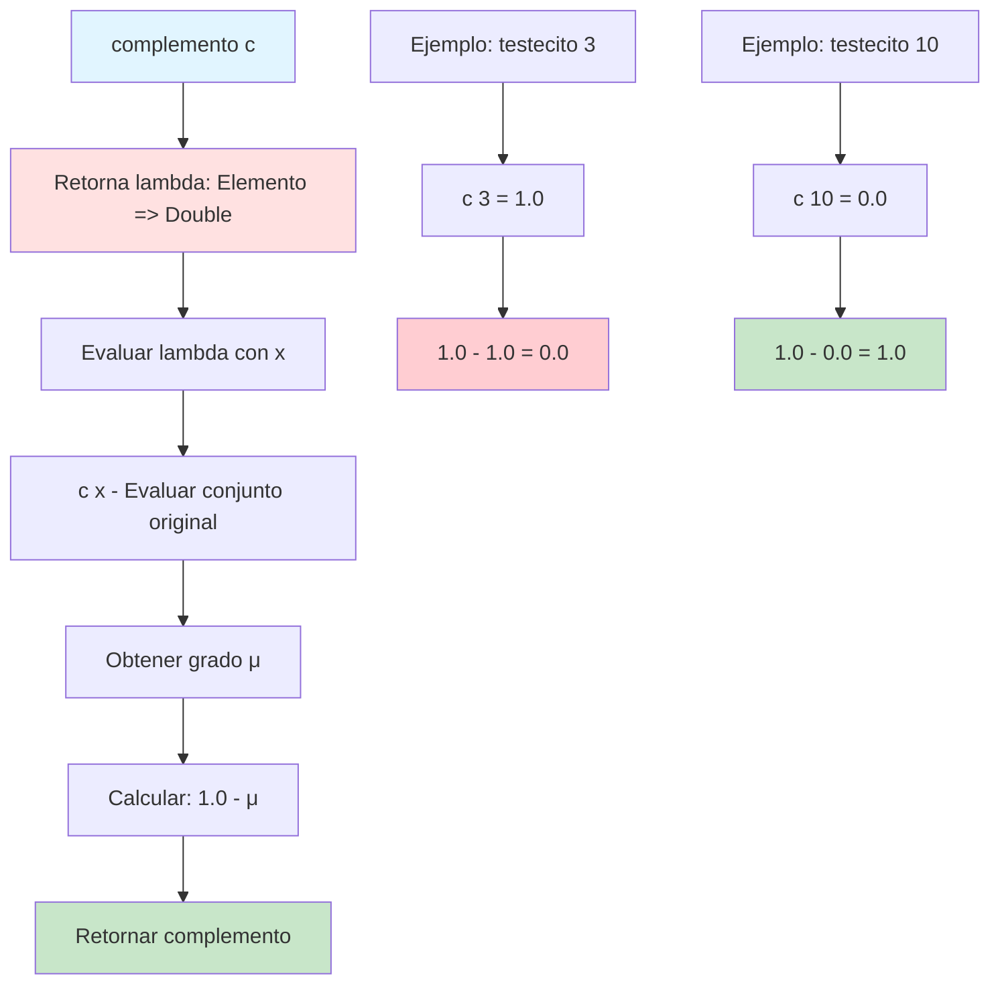
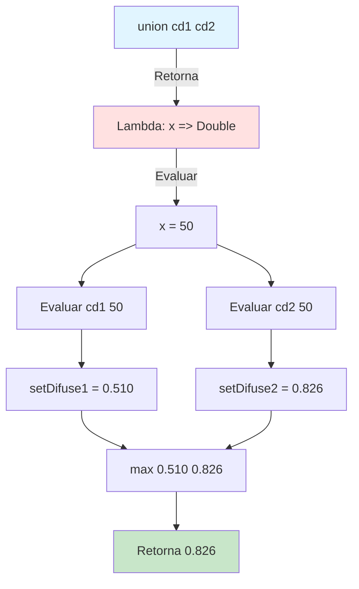
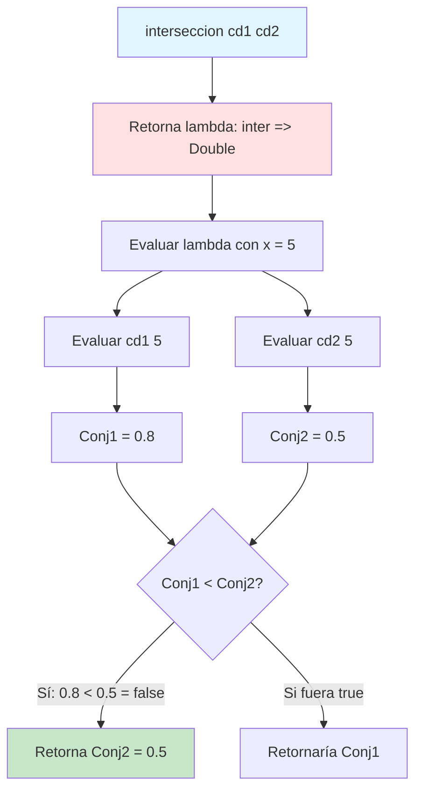
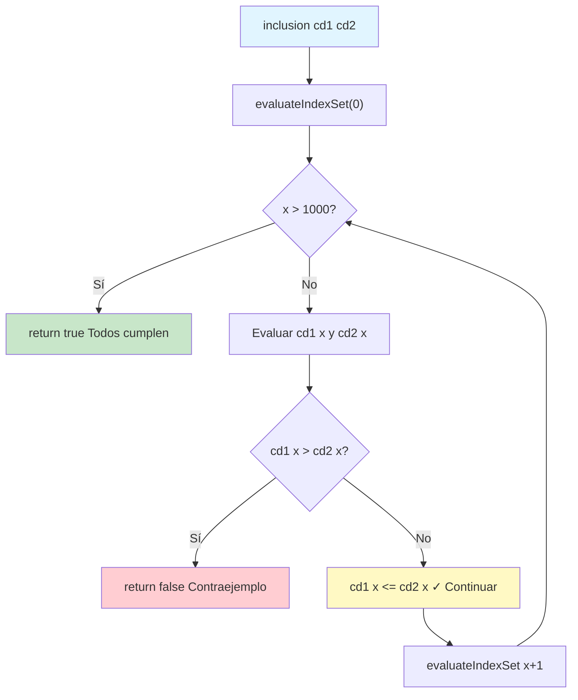
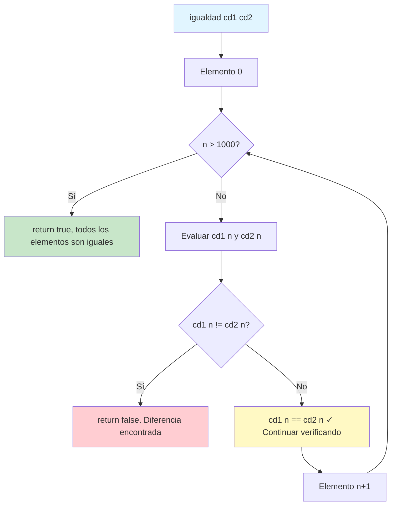

# 📘 Taller 2:  Programación Funcional y Concurrente
**Tema:** Ejercicios de programación: Conjuntos difusos

🗓️**Fecha:** Octubre de 2025

---
## 🧩 Introducción
### 🔢 Conjuntos difusos y lógica difusa
Los conjuntos difusos son una extensión de los conjuntos clásicos que permiten representar la pertenencia parcial de un elemento. A diferencia de los conjuntos 
tradicionales donde un elemento pertenece completamente (1) o no pertenece (0), en los conjuntos difusos un elemento puede tener un grado de pertenencia entre 0 y 1.

Este taller implementa `siete operaciones fundamentales` sobre conjuntos difusos:

1. **Pertenece**: Función que evalúa el grado de pertenencia de un elemento en un conjunto difuso
2. **Grande**: Función que determina qué tan "grande" es un número
3. **Complemento**: Operación que invierte los grados de pertenencia de un conjunto
4. **Union**: Operación que combina dos conjuntos difusos tomando el máximo
5. **Interseccion**: Operación que combina dos conjuntos tomando el mínimo
6. **Inclusion**: Relación que verifica si un conjunto está contenido en otro
7. **Igualdad**: Relación que verifica si dos conjuntos son idénticos

---
## ALGORITMOS
### 🔷 DEFINICIÓN FUNCIÓN "PERTENECE"
La función `pertenece` es la operación fundamental que permite evaluar el grado de pertenencia de un elemento a un conjunto difuso. Esta función aplica la función característica del conjunto difuso a un elemento específico, retornando un valor en el intervalo $[0, 1]$.

Matemáticamente, para un conjunto difuso $S$ con función característica $f_S: U \to [0,1]$:

$$
\text{pertenece}(x, S) = f_S(x)
$$

#### ALGORITMO EN SCALA:
```scala
```scala
def pertenece(elem: Int, s: ConjDifuso): Double = {
  s(elem)
}
```
**Componentes de la función:**
- `elem: Int`: El elemento del universo a evaluar
- `s: ConjDifuso`: El conjunto difuso (función `Int => Double`)
- Retorna `Double`: El grado de pertenencia en el intervalo $[0, 1]$

### 🔧 EXPLICACIÓN PASO A PASO

#### EVALUACIÓN DIRECTA:
La función simplemente aplica el conjunto difuso `s` (que es una función) al elemento `elem`. Dado que un `ConjDifuso` está definido como `type ConjDifuso = Int => Double`, esta aplicación es directa y retorna el grado de pertenencia.

**Interpretación del resultado:**
- Si retorna $0.0$: El elemento **no pertenece** al conjunto
- Si retorna $1.0$: El elemento **pertenece completamente** al conjunto
- Si retorna un valor entre $0.0$ y $1.0$: El elemento tiene **pertenencia parcial**
- **Evaluaciones:**

| Conjunto    | Elemento | Llamada                   | Resultado | Interpretación              |
|-------------|----------|---------------------------|-----------|----------------------------|
| `vacio`     | 5        | `pertenece(5, vacio)`     | $0.0$     | No pertenece               |
| `universal` | 100      | `pertenece(100, universal)` | $1.0$   | Pertenece completamente    |
| `testecito` | 2        | `pertenece(2, testecito)` | $1.0$     | Pertenece (2 ≤ 5)          |
| `testecito` | 7        | `pertenece(7, testecito)` | $0.0$     | No pertenece (7 > 5)       |
| `medio`     | 10       | `pertenece(10, medio)`    | $0.5$     | Pertenencia parcial        |

### 📊 DIAGRAMA DE EVALUACIÓN DE `pertenece`


### 🧾 NOTACIÓN MATEMÁTICA DE `pertenece`

#### 📐 DEFINICIÓN FORMAL

$$
\text{pertenece} : \mathbb{Z} \times \text{ConjDifuso} \to [0, 1]
$$

$$
\text{pertenece}(x, S) = \mu_S(x)
$$

donde $\mu_S: \mathbb{Z} \to [0, 1]$ es la función de pertenencia del conjunto difuso $S$.

#### 📐 PROPIEDADES

**Rango de valores:**

$$
\forall x \in \mathbb{Z}, \forall S \in \text{ConjDifuso} : 0 \leq \text{pertenece}(x, S) \leq 1
$$

**Conjunto vacío:**

$$
\forall x \in \mathbb{Z} : \text{pertenece}(x, \emptyset) = 0
$$

**Conjunto universal:**

$$
\forall x \in \mathbb{Z} : \text{pertenece}(x, U) = 1
$$

**Aplicación funcional:** La operación es simplemente la aplicación de la función característica:

$$
\text{pertenece}(x, S) = f_S(x)
$$

#### 📊 COMPLEJIDAD

- **Temporal**: $O(1)$ - La evaluación depende de la complejidad de la función característica del conjunto difuso específico
- **Espacial**: $O(1)$ - No requiere memoria adicional, solo evalúa la función

**Nota:** La complejidad real puede variar según la implementación del conjunto difuso. Por ejemplo:
- Conjunto constante: $O(1)$
- Conjunto con cálculos: $O(k)$ donde $k$ es la complejidad del cálculo interno
- Para `grande(d)(e)`: $O(1)$ con operaciones de división y potencia

---
## ALGORITMOS
### 🔷 DEFINICIÓN FUNCIÓN "GRANDE"
La función `grande` crea un conjunto difuso que modela el concepto de "números grandes" mediante una función sigmoidal parametrizada. Utiliza la siguiente fórmula matemática:

Para un número $n$, su grado de pertenencia al conjunto de "números grandes" se define como:

$$
\text{grande}(n) =
\begin{cases}
0 & \text{si } n \leq 0 \\
\left(\frac{n}{n+d}\right)^e & \text{si } n > 0
\end{cases}
$$

Donde:
- $d$: Parámetro que controla la sensibilidad (valores más pequeños hacen que los números se consideren "grandes" más rápidamente).
- $e$: Exponente que controla la curvatura de la función.

#### Algoritmo en Scala:

```Scala
def grande(d: Int)(e: Int): ConjDifuso = {
    //belongsTo is the lambda to work with the number and make it
    // a ConjDiffuse
    val belongsTo = (n: Int) => {

      if (n <= 0) 0.0 //Statement to know when a number is negative

      else {

        val isItGreat = n.toDouble / (n.toDouble+d.toDouble)
        //Equation to know when a number is great
        math.pow(isItGreat, e)
        //To know if the number is great or not
      }
    }
    belongsTo
  }
```
**Componentes de la función:**
- `d: Int`: Primer parámetro que controla el desplazamiento horizontal de la curva.
- `e: Int`: Segundo parámetro que controla la pendiente (curvatura).
- `belongsTo`: Lambda que representa el conjunto difuso resultante.
- Retorna un `ConjDifuso` (función `Int => Double`)
- 
### 🔧 EXPLICACIÓN PASO A PASO
#### CASO BASE:
`if (n <= 0) 0.0`

Cuando $n$ es negativo o cero, el grado de pertenencia es 0, esto ya que un número no positivo o negativo no puede considerarse grande.

### CASO GENERAL:
```Scala
  else {
    val isItGreat = n.toDouble / (n.toDouble+d.toDouble)
    //Equation to know when a number is great
    math.pow(isItGreat, e)
    //To know if the number is great or not
  }
```
**Paso 1:** Calcular la fracción base

$$
\text{base} = \frac{n}{n+d}
$$

Esta fracción siempre está en el rango $(0, 1)$ para $n > 0$.

**Paso 2:** Elevar a la potencia $e$

$$
\text{grado} = \left(\frac{n}{n+d}\right)^e
$$

El exponente $e$ controla qué tan rápido crece el grado de pertenencia.

### 📝 EJEMPLO DE EJECUCIÓN DE `grande`
`val bigNumbers = grande(10)(2)`
**Evaluaciones:**

| Entrada           | Cálculo                        | Resultado       |
|-------------------|--------------------------------|-----------------|
| `numGrandes(0)`   | $0$                            | $0.0$           |
| `numGrandes(10)`  | $(10/(10+10))^2 = (0.5)^2$     | $0.25$          |
| `numGrandes(50)`  | $(50/(50+10))^2 = (0.833)^2$   | $\approx 0.694$ |
| `numGrandes(100)` | $(100/(100+10))^2 = (0.909)^2$ | $\approx 0.826$ |

### 📊 DIAGRAMA DE EVALUACIÓN DE `grande(10)(2)`

### 🧾 NOTACIÓN MATEMÁTICA DE `grande`

#### 📐 DEFINICIÓN FORMAL

$$
\text{grande}(d)(e) : \mathbb{Z} \to \text{ConjDifuso}
$$

$$
\text{ConjDifuso} = \mathbb{Z} \to [0, 1]
$$

$$
\text{grande}(d)(e)(n) =
\begin{cases}
0 & \text{si } n \leq 0 \\
\left(\frac{n}{n+d}\right)^e & \text{si } n > 0
\end{cases}
$$

#### 🔁 PROPIEDADES

**Monotonía:** Para todo $n_1 < n_2$ con $n_1, n_2 > 0$:

$$
\text{grande}(d)(e)(n_1) < \text{grande}(d)(e)(n_2)
$$

**Límites:**

$$
\lim_{n \to 0^+} \text{grande}(d)(e)(n) = 0
$$

$$
\lim_{n \to \infty} \text{grande}(d)(e)(n) = 1
$$

**Efecto del parámetro $d$:** Valores menores de $d$ hacen que la función crezca más rápidamente.

**Efecto del parámetro $e$:** Valores mayores de $e$ hacen la curva más pronunciada (efecto exponencial).

#### 📊 COMPLEJIDAD

- **Temporal**: $O(1)$ - evaluación constante por cada valor
- **Espacial**: $O(1)$ - la función lambda no requiere memoria adicional


---
## ALGORITMOS
### 🔷 DEFINICIÓN FUNCIÓN "COMPLEMENTO"
La función `complemento` devuelve el conjunto difuso complementario de un conjunto dado. El complemento invierte los grados de pertenencia: elementos con alta pertenencia en el conjunto original tendrán baja pertenencia en el complemento, y viceversa.

Matemáticamente, para un conjunto difuso $S$ con función característica $f_S$:

$$
f_{\neg S}(x) = 1 - f_S(x)
$$

#### ALGORITMO EN SCALA:

```scala
def complemento(c: ConjDifuso): ConjDifuso = {
  (Elemento: Int) => 1.0 - c(Elemento)
}
```

**Componentes de la función:**
- `c: ConjDifuso`: El conjunto difuso original
- `Elemento: Int`: Variable que representa el elemento a evaluar en la lambda
- Retorna un nuevo `ConjDifuso` que representa el complemento


### 🔧 EXPLICACIÓN PASO A PASO

#### CONSTRUCCIÓN DE LA LAMBDA:
```scala
(Elemento: Int) => 1.0 - c(Elemento)
```

La función retorna una nueva función lambda que:
1. Recibe un elemento `Elemento` del universo
2. Evalúa el grado de pertenencia original: `c(Elemento)`
3. Calcula el complemento mediante la resta: `1.0 - c(Elemento)`

**Paso 1:** Evaluar el conjunto original

$$
\mu_S(x) = c(x)
$$

**Paso 2:** Calcular el complemento

$$
\mu_{\neg S}(x) = 1.0 - \mu_S(x)
$$

Esta operación garantiza que si un elemento pertenece totalmente al conjunto original ($\mu_S(x) = 1.0$), no pertenecerá al complemento ($\mu_{\neg S}(x) = 0.0$), y viceversa.

### 📝 EJEMPLO DE EJECUCIÓN DE `complemento`

```scala
val vacio: ConjDifuso = _ => 0.0
val universal: ConjDifuso = _ => 1.0
val testecito: ConjDifuso = (x: Int) => if (x <= 5) 1.0 else 0.0
val medio: ConjDifuso = _ => 0.5

val compVacio = complemento(vacio)
val compUniversal = complemento(universal)
val compTestecito = complemento(testecito)
val compMedio = complemento(medio)
```
**Evaluaciones:**

| Conjunto Original | Elemento | Grado Original | Grado Complemento | Cálculo               |
|-------------------|----------|----------------|-------------------|-----------------------|
| `vacio`           | 5        | $0.0$          | $1.0$             | $1.0 - 0.0 = 1.0$     |
| `universal`       | 100      | $1.0$          | $0.0$             | $1.0 - 1.0 = 0.0$     |
| `testecito`       | 3        | $1.0$          | $0.0$             | $1.0 - 1.0 = 0.0$     |
| `testecito`       | 10       | $0.0$          | $1.0$             | $1.0 - 0.0 = 1.0$     |
| `medio`           | 15       | $0.5$          | $0.5$             | $1.0 - 0.5 = 0.5$     |

**Propiedad del doble complemento:**
```scala
val dobleComp = complemento(complemento(testecito))
// dobleComp(3) == testecito(3) == 1.0
// dobleComp(10) == testecito(10) == 0.0
```

### 📊 DIAGRAMA DE EVALUACIÓN DE `complemento`



### 🧾 NOTACIÓN MATEMÁTICA DE `complemento`

#### 📐 DEFINICIÓN FORMAL

$$
\text{complemento} : \text{ConjDifuso} \to \text{ConjDifuso}
$$

$$
\text{complemento}(S)(x) = 1 - \mu_S(x)
$$

Equivalentemente:

$$
\mu_{\neg S}(x) = 1 - \mu_S(x)
$$

donde $\mu_S: \mathbb{Z} \to [0,1]$ es la función de pertenencia del conjunto difuso $S$.

#### 📐 PROPIEDADES

**Involutividad (Doble complemento):**

$$
\neg(\neg S) = S
$$

$$
\forall x \in U : \mu_{\neg(\neg S)}(x) = 1 - (1 - \mu_S(x)) = \mu_S(x)
$$

**Leyes de De Morgan:**

$$
\neg(S_1 \cup S_2) = \neg S_1 \cap \neg S_2
$$

$$
\neg(S_1 \cap S_2) = \neg S_1 \cup \neg S_2
$$

**Complemento del vacío:**

$$
\neg \emptyset = U
$$

$$
\forall x : \mu_{\neg \emptyset}(x) = 1 - 0 = 1
$$

**Complemento del universal:**

$$
\neg U = \emptyset
$$

$$
\forall x : \mu_{\neg U}(x) = 1 - 1 = 0
$$

**Intersección con su complemento:**

$$
S \cap \neg S \neq \emptyset \text{ (en general)}
$$

A diferencia de la lógica clásica, en lógica difusa un conjunto y su complemento pueden tener elementos con pertenencia parcial en ambos.

**Unión con su complemento:**

$$
S \cup \neg S \neq U \text{ (en general)}
$$

Estas propiedades muestran que la lógica difusa no es necesariamente una lógica booleana.

#### 📊 COMPLEJIDAD

- **Temporal**: $O(1)$ - Crear la función lambda es constante
- **Espacial**: $O(1)$ - Solo se crea una clausura con referencia al conjunto original

**Complejidad de evaluación:**
- Cuando se evalúa el complemento en un elemento: $O(1) + T_c$ donde $T_c$ es el tiempo de evaluar el conjunto original

---
## ALGORITMOS
### 🔷 DEFINICIÓN FUNCIÓN "UNION"
La función `union` combina dos conjuntos difusos aplicando el operador de máximo (t-conorma estándar). Para cada elemento, toma el mayor grado de pertenencia entre ambos conjuntos.

La operación se define matemáticamente como:

$$
(A \cup B)(x) = \max(A(x), B(x))
$$

#### ALGORITMO EN SCALA:
```scala
  def union(cd1: ConjDifuso)(cd2: ConjDifuso): ConjDifuso = {
    // Lambda that makes a union between the two set
    val unionSet = (x: Int) => {

      val setDifuse1 = cd1(x) //Evaluate the value of the first set
      val setDifuse2 = cd2(x) // Evaluate the second set´s value

      // Choose the max between set 1 and set 2 to complete the union
      val unionSd1Sd2 = math.max(setDifuse1, setDifuse2)

      unionSd1Sd2 //The final value of lambda
    }
    unionSet
  }
```
**Componentes de la función:**
- `cd1: ConjDifuso`: Primer conjunto difuso
- `cd2: ConjDifuso`: Segundo conjunto difuso
- `unionSet`: Lambda que implementa el máximo punto a punto
- Retorna un nuevo `ConjDifuso` que representa la unión

### 🔧 EXPLICACIÓN PASO A PASO

#### EVALUACIÓN DE AMBOS CONJUNTOS:
```scala
val setDifuse1 = cd1(x) //Evaluate the value of the first set
val setDifuse2 = cd2(x) // Evaluate the second set´s value
```
Se evalúa el elemento $x$ en ambos conjuntos difusos para obtener sus grados de pertenencia.

#### APLICACIÓN DEL MÁXIMO:
```scala
// Choose the max between set 1 and set 2 to complete the union
val unionSd1Sd2 = math.max(setDifuse1, setDifuse2)
```
Se selecciona el mayor de los dos grados. Esto refleja que en lógica difusa, la unión representa "pertenencia a al menos uno de los conjuntos".

### 📝 EJEMPLO DE EJECUCIÓN DE`union`
```scala
val smallN = grande(20)(2)
val bigN = grande(5)(2)
val unionOfSet = union(pequenos)(grandes)
```
**Evaluaciones:**

#### Para $x = 50$:

| Conjunto         | Cálculo              | Resultado       |
|------------------|----------------------|-----------------|
| `smallN(50)`     | $(50/70)^2$          | $\approx 0.510$ |
| `bigN(50)`       | $(50/55)^2$          | $\approx 0.826$ |
| `unionOfSet(50)` | $\max(0.510, 0.826)$ | $0.826$         |

#### Para $x = 100$:

| Conjunto          | Cálculo              | Resultado       |
|-------------------|----------------------|-----------------|
| `smallN(100)`     | $(100/120)^2$        | $\approx 0.694$ |
| `bigN(100)`       | $(100/105)^2$        | $\approx 0.907$ |
| `unionOfSet(100)` | $\max(0.694, 0.907)$ | $0.907$         |

### 📊 DIAGRAMA DE `union`

### 🧾 NOTACIÓN MATEMÁTICA DE `union`

#### 📐 DEFINICIÓN FORMAL

$$
\text{union} : \text{ConjDifuso} \to \text{ConjDifuso} \to \text{ConjDifuso}
$$

$$
\text{union}(A)(B)(x) = \max(A(x), B(x))
$$

Equivalentemente:

$$
(A \cup B)(x) = A(x) \vee B(x)
$$

donde $\vee$ denota el operador de máximo (t-conorma).

#### 🔁 PROPIEDADES ALGEBRAICAS

**Conmutatividad:**

$$
A \cup B = B \cup A
$$

**Asociatividad:**

$$
(A \cup B) \cup C = A \cup (B \cup C)
$$

**Idempotencia:**

$$
A \cup A = A
$$

**Elemento neutro** (conjunto vacío $\emptyset$):

$$
A \cup \emptyset = A
$$

donde $\emptyset(x) = 0$ para todo $x$.

**Absorción** (conjunto universal $U$):

$$
A \cup U = U
$$

donde $U(x) = 1$ para todo $x$.

**Monotonicidad:** Si $A \subseteq B$, entonces:

$$
A \cup C \subseteq B \cup C
$$

#### 📊 COMPLEJIDAD

- **Temporal**: $O(1)$ - evaluación constante por elemento
- **Espacial**: $O(1)$ - no requiere memoria adicional

---
## ALGORITMOS

## ALGORITMOS
### 📷 DEFINICIÓN FUNCIÓN "INTERSECCIÓN"
La función `interseccion` combina dos conjuntos difusos aplicando el operador de mínimo (t-norma estándar). Para cada elemento, toma el menor grado de pertenencia entre ambos conjuntos, representando así los elementos que pertenecen a ambos conjuntos simultáneamente.

La operación se define matemáticamente como:

$$
(A \cap B)(x) = \min(A(x), B(x))
$$

#### ALGORITMO EN SCALA:

```scala
def interseccion(cd1: ConjDifuso, cd2: ConjDifuso): ConjDifuso = {
  (inter: Int) =>
    val Conj1 = cd1(inter)
    val Conj2 = cd2(inter)
    if (Conj1 < Conj2)
      Conj1
    else
      Conj2
}
```

**Componentes de la función:**
- `cd1: ConjDifuso`: Primer conjunto difuso
- `cd2: ConjDifuso`: Segundo conjunto difuso
- `inter: Int`: Variable que representa el elemento a evaluar en la lambda
- Retorna un nuevo `ConjDifuso` que representa la intersección

### 🔧 EXPLICACIÓN PASO A PASO

#### EVALUACIÓN DE AMBOS CONJUNTOS:
```scala
val Conj1 = cd1(inter)
val Conj2 = cd2(inter)
```
Se evalúa el elemento en ambos conjuntos difusos para obtener sus grados de pertenencia.

#### APLICACIÓN DEL MÍNIMO:
```scala
if (Conj1 < Conj2)
  Conj1
else
  Conj2
```
Se selecciona el menor de los dos grados. Esto refleja que en lógica difusa, la intersección representa "pertenencia a ambos conjuntos", donde el grado más restrictivo (menor) determina el resultado.

**Paso 1:** Evaluar ambos conjuntos

$$
\mu_{A}(x) = cd1(x)
$$

$$
\mu_{B}(x) = cd2(x)
$$

**Paso 2:** Calcular el mínimo

$$
\mu_{A \cap B}(x)
= \min(\mu_A(x), \mu_B(x))
$$
### 📝 EJEMPLO DE EJECUCIÓN DE `interseccion`

```scala
val vacio: ConjDifuso = _ => 0.0
val universal: ConjDifuso = _ => 1.0
val testecito: ConjDifuso = (x: Int) => if (x <= 5) 1.0 else 0.0

val c1: ConjDifuso = _ => 0.7
val c2: ConjDifuso = _ => 0.4

val interVacioTest = interseccion(vacio, testecito)
val interUniversalTest = interseccion(universal, testecito)
val interC1C2 = interseccion(c1, c2)
```

**Evaluaciones:**

| Conjunto 1      | Conjunto 2   | Elemento | Grado cd1 | Grado cd2 | Intersección            | Resultado |
|-----------------|--------------|----------|-----------|-----------|-------------------------|-----------|
| `vacio`         | `testecito`  | 2        | $0.0$     | $1.0$     | $\min(0.0, 1.0)$        | $0.0$     |
| `vacio`         | `testecito`  | 10       | $0.0$     | $0.0$     | $\min(0.0, 0.0)$        | $0.0$     |
| `universal`     | `testecito`  | 4        | $1.0$     | $1.0$     | $\min(1.0, 1.0)$        | $1.0$     |
| `universal`     | `testecito`  | 25       | $1.0$     | $0.0$     | $\min(1.0, 0.0)$        | $0.0$     |
| `c1` (0.7)      | `c2` (0.4)   | 5        | $0.7$     | $0.4$     | $\min(0.7, 0.4)$        | $0.4$     |

**Ejemplo con grados variables:**
```scala
val c3: ConjDifuso = (x: Int) => if (x < 10) 0.8 else 0.3
val c4: ConjDifuso = (x: Int) => if (x < 10) 0.5 else 0.9

val inter = interseccion(c3, c4)
// inter(5) = min(0.8, 0.5) = 0.5
// inter(15) = min(0.3, 0.9) = 0.3
```

### 📊 DIAGRAMA DE EVALUACIÓN DE `interseccion`



### 🧾 NOTACIÓN MATEMÁTICA DE `interseccion`

#### 📐 DEFINICIÓN FORMAL

$$
\text{interseccion} : \text{ConjDifuso} \times \text{ConjDifuso} \to \text{ConjDifuso}
$$

$$
\text{interseccion}(A, B)(x) = \min(A(x), B(x))
$$

Equivalentemente:

$$
(A \cap B)(x) = A(x) \wedge B(x)
$$

donde $\wedge$ denota el operador de mínimo (t-norma estándar).

#### 📐 PROPIEDADES ALGEBRAICAS

**Conmutatividad:**

$$
A \cap B = B \cap A
$$

**Asociatividad:**

$$
(A \cap B) \cap C = A \cap (B \cap C)
$$

**Idempotencia:**

$$
A \cap A = A
$$

**Elemento neutro** (conjunto universal $U$):

$$
A \cap U = A
$$

donde $U(x) = 1$ para todo $x$.

**Absorción** (conjunto vacío $\emptyset$):

$$
A \cap \emptyset = \emptyset
$$

donde $\emptyset(x) = 0$ para todo $x$.

**Monotonicidad:** Si $A \subseteq B$, entonces:

$$
A \cap C \subseteq B \cap C
$$

**Distributividad con la unión:**

$$
A \cap (B \cup C) = (A \cap B) \cup (A \cap C)
$$

**Relación con el complemento (Ley de De Morgan):**

$$
\neg(A \cap B) = \neg A \cup \neg B
$$

#### 📐 DIFERENCIA CON CONJUNTOS CLÁSICOS

En conjuntos clásicos:

$$
A \cap \neg A = \emptyset
$$

En conjuntos difusos, esto no se cumple necesariamente. Por ejemplo, si $\mu_A(x) = 0.6$:


$$
\mu_{A \cap \neg A}(x) = \min(0.6, 1-0.6) = \min(0.6, 0.4) = 0.4 \neq 0
$$

#### 📊 COMPLEJIDAD

- **Temporal**: $O(1)$ - Evaluación constante por elemento (crear la lambda es constante)
- **Espacial**: $O(1)$ - Solo se crea una clausura con referencias a los conjuntos originales

**Complejidad de evaluación:**
- Cuando se evalúa la intersección en un elemento: $O(T_{cd1} + T_{cd2})$ donde $T_{cd1}$ y $T_{cd2}$ son los tiempos de evaluar cada conjunto original

---
## ALGORITMOS
### 🔷 DEFINICIÓN FUNCIÓN "INCLUSION"
La función `inclusion` verifica si un conjunto difuso está completamente incluido en otro. Esto significa que para **todos** los elementos del universo, el grado de pertenencia en el primer conjunto debe ser menor o igual que en el segundo.

Matemáticamente:

$$
A \subseteq B \iff \forall x \in U : A(x) \leq B(x)
$$

Para verificar esta propiedad en el rango $[0, 1000]$, se utiliza recursión de cola.

#### ALGORITMO EN SCALA:

```scala
  def inclusion(cd1: ConjDifuso)(cd2: ConjDifuso): Boolean = {
  /*
  In this function we use tail recursion to evaluate in every number
  lower than 1000
   */
  @tailrec
  def evaluateIndexSet(x: Int): Boolean = {

    val setDifuse1 = cd1(x) //Evaluate the value of the first set
    val setDifuse2 = cd2(x) // Evaluate the second set´s value

    // base case where we evaluate all the number from 0 to 1000
    if (x > 1000) {
      true
    }

    // Second case where we evaluate if the first set is included in the second set
    else if (setDifuse1 > setDifuse2) {
      false
    }

    // Recursive case where if all is passed and the number is lower than 1000
    // we proceed to evaluate the next number until be higher than 1000
    else {
      evaluateIndexSet(x + 1)
    }
  }
  //Start the case in the first number that we can
  evaluateIndexSet(0)
}
```
**Componentes de la función:**
- `cd1: ConjDifuso`: Conjunto que verificamos si está incluido
- `cd2: ConjDifuso`: Conjunto que potencialmente contiene a cd1
- `evaluateIndexSet`: Función auxiliar recursiva de cola
- `@tailrec`: Garantiza optimización de recursión
- Retorna `Boolean`: `true` si $cd1 \subseteq cd2$, `false` en caso contrario

### 🔧 EXPLICACIÓN PASO A PASO

#### CASO BASE (VERIFICACIÓN FINAL):
```scala
// base case where we evaluate all the number from 0 to 1000
if (x > 1000) {
  true
}
```
Sí se verificaron todos los elementos del rango $[0, 1000]$ sin encontrar violaciones, entonces $cd1 \subseteq cd2$.

#### CASO DE VIOLACIÓN:
```scala
// Second case where we evaluate if the first set is included in the second set
else if (setDifuse1 > setDifuse2) {
  false
}
```
Si en algún punto $cd1(x) > cd2(x)$, se encuentra un contraejemplo y la inclusión es falsa. Se aplica **corto circuito**: no es necesario verificar el resto.

#### CASO RECURSIVO:
```scala
// Recursive case where if all is passed and the number is lower than 1000
// we proceed to evaluate the next number until be higher than 1000
else{
  evaluateIndexSet(x+1)
}
```
Si $cd1(x) \leq cd2(x)$, este elemento cumple la condición. Se continúa verificando el siguiente elemento.

### 📝 EJEMPLO DE EJECUCIÓN DE `inclusion`
```scala
val smallN = grande(30)(2)
val bigN = grande(5)(2)
val inclusionInSet = inclusion(pequenos)(grandes)
```
### 📊 DIAGRAMA DE `inclusion` CON RECURSIÓN DE COLA

### 🧾 NOTACIÓN MATEMÁTICA DE `inclusion`

#### 📐 DEFINICIÓN NORMAL

$$
\text{inclusion} : \text{ConjDifuso} \to \text{ConjDifuso} \to \text{Boolean}
$$

$$
\text{inclusion}(A)(B) =
\begin{cases}
\text{true} & \text{si } \forall x \in [0, 1000] : A(x) \leq B(x) \\
\text{false} & \text{en otro caso}
\end{cases}
$$

Formalmente:

$$
A \subseteq B \iff \forall x \in U : \mu_A(x) \leq \mu_B(x)
$$

donde $\mu_A(x)$ es la función de pertenencia del conjunto difuso $A$.

#### 🔁 PROPIEDADES

**Reflexividad:**

$$
\forall A : A \subseteq A
$$

**Antisimetría:**

$$
(A \subseteq B) \land (B \subseteq A) \implies A = B
$$

**Transitividad:**

$$
(A \subseteq B) \land (B \subseteq C) \implies A \subseteq C
$$

**Relación con el vacío:**

$$
\forall A : \emptyset \subseteq A
$$

**Relación con el universal:**

$$
\forall A : A \subseteq U
$$

**Relación con la unión:**

$$
A \subseteq C \land B \subseteq C \implies (A \cup B) \subseteq C
$$

#### 🔁 INVARIANTE DE RECURSIÓN

Para toda llamada válida de `evaluateIndexSet(x)` se cumple:

$$
\forall i \in [0, x) : cd1(i) \leq cd2(i)
$$

Es decir, todos los elementos anteriores a $x$ ya fueron verificados y cumplen la condición de inclusión.

**Caso base:** Cuando $x > 1000$, el invariante asegura que:

$$
\forall i \in [0, 1000] : cd1(i) \leq cd2(i)
$$

Por tanto, $cd1 \subseteq cd2$ y se retorna `true`.

#### 📊 COMPLEJIDAD

**Análisis temporal:**

- **Mejor caso**: $O(1)$ - si se encuentra violación en el primer elemento ($x = 0$)
- **Peor caso**: $O(n)$ donde $n = 1001$ - verifica todo el rango $[0, 1000]$
- **Caso promedio**: $O(k)$ donde $k$ es el índice del primer contraejemplo

Para este dominio específico:

$$
T(n) = O(1001) = O(1) \text{ (constante para el universo definido)}
$$

**Análisis espacial:**

- **Espacial**: $O(1)$ - recursión de cola optimizada por el compilador Scala
- La anotación `@tailrec` garantiza que la recursión se convierte en un bucle iterativo
- No crece la pila de llamadas


---
## ALGORITMOS
### 🔷 DEFINICIÓN FUNCIÓN "IGUALDAD"
La función `igualdad` verifica si dos conjuntos difusos son idénticos en todo el universo de discurso. Dos conjuntos son iguales si y solo si tienen el mismo grado de 
pertenencia para **todos** los elementos.

Matemáticamente:

$$
A = B \iff \forall x \in U : A(x) = B(x)
$$

Para verificar esta propiedad en el rango $[0, 1000]$, se utiliza recursión de cola.

#### ALGORITMO EN SCALA:
```scala
  def igualdad(cd1: ConjDifuso, cd2: ConjDifuso): Boolean = {
    @tailrec
    def Elemento (n: Int): Boolean = {
      if (n > 1000)   // no se encuentra ningun elemento diferente
        true
      else if (cd1(n) != cd2(n)) // Caso de corte, se encuentra un valor que no es igual
        false
      else
        Elemento (n + 1)  // Paso recursivo,se sigue comparando
    }
    Elemento (0)
  }
```
**Componentes de la función:**
- `cd1: ConjDifuso`: Primer conjunto difuso
- `cd2: ConjDifuso`: Segundo conjunto difuso
- `Elemento`: Función auxiliar recursiva de cola
- `@tailrec`: Garantiza optimización de recursión
- Retorna `Boolean`: `true` si $cd1 = cd2$, `false` en caso contrario

### 🔧 EXPLICACIÓN PASO A PASO

#### CASO BASE (VERIFICACIÓN FINAL):
```scala
if (n > 1000)   // no se encuentra ningún elemento diferente 
  true
```
Si se verificaron todos los elementos del rango $[0, 1000]$ sin encontrar diferencias, entonces $cd1 = cd2$.

#### CASO DE DIFERENCIA:
```scala
else if (cd1(n) != cd2(n)) // Caso de corte, se encuentra un valor que no es igual
  false
```
Si en algún punto $cd1(n) \neq cd2(n)$, se encuentra un contraejemplo y los conjuntos no son iguales. Se aplica **corto circuito**: no es necesario verificar el resto.

#### CASO RECURSIVO:
```scala
else
  Elemento (n + 1)  // Paso recursivo,se sigue comparando
```
Si $cd1(n) = cd2(n)$, este elemento cumple la condición. Se continúa verificando el siguiente elemento.

### 📝 EJEMPLO DE EJECUCIÓN DE `igualdad`
```scala
val difuseSet1 = grande(10)(2)
val difuseSet2 = grande(10)(2)
val difuseSet3 = grande(15)(2)

val outCome1 = igualdad(conjunto1, conjunto2)
val outCome2 = igualdad(conjunto1, conjunto3)
```
**Traza de ejecución para `igualdad(difuseSet1, difuseSet2)`:**
```scala
Elemento(0): 
difuseSet1(0) = 0.0, difuseSet2(0) = 0.0
0.0 == 0.0 ✓ → Elemento(1)

Elemento(1):
difuseSet1(1) = math.pow((1/11), 2) ≈ 0.0083
difuseSet2(1) = math.pow((1/11), 2) ≈ 0.0083
0.0083 == 0.0083 ✓ → Elemento(2)

...continúa verificando...

Elemento(1000):
difuseSet1(1000) ≈ 0.9803
difuseSet2(1000) ≈ 0.9803
✓ → Elemento(1001)

Elemento(1001):
1001 > 1000 → return true

outCome1: true (conjunto1 = conjunto2)
```
**Traza de ejecución para `igualdad(difuseSet1, difuseSet3)`:**
```scala
Elemento(0):
difuseSet1(0) = 0.0, difuseSet3(0) = 0.0
0.0 == 0.0 ✓ → Elemento(1)

Elemento(1):
difuseSet1(1) = math.pow((1/11), 2) ≈ 0.0083
difuseSet3(1) = math.pow((1/16), 2) ≈ 0.0039
0.0083 != 0.0039 ✗ → return false

outCome2: false (conjunto1 ≠ conjunto3)
```
### 📊 DIAGRAMA DE `igualdad` CON RECURSIÓN DE COLA

### 🧾 NOTACIÓN DE MATEMÁTICAS DE `igualdad`

#### 📐 DEFINICIÓN FORMAL

$$
\text{igualdad} : \text{ConjDifuso} \times \text{ConjDifuso} \to \text{Boolean}
$$

$$
\text{igualdad}(A, B) =
\begin{cases}
\text{true} & \text{si } \forall x \in [0, 1000] : A(x) = B(x) \\
\text{false} & \text{en otro caso}
\end{cases}
$$

Formalmente:

$$
A = B \iff \forall x \in U : \mu_A(x) = \mu_B(x)
$$

donde $\mu_A(x)$ y $\mu_B(x)$ son las funciones de pertenencia de los conjuntos difusos $A$ y $B$ respectivamente.

#### 🔁 PROPIEDADES

**Reflexividad:**

$$
\forall A : A = A
$$

**Simetría:**

$$
A = B \implies B = A
$$

**Transitividad:**

$$
(A = B) \land (B = C) \implies A = C
$$

**Relación con la inclusión:** La igualdad es equivalente a la inclusión mutua:

$$
A = B \iff (A \subseteq B) \land (B \subseteq A)
$$

**Propiedad de sustitución:** Si $A = B$, entonces para cualquier operación $\circ$:

$$
A \circ C = B \circ C
$$

#### 🔁 INVARIANTE DE RECURSIÓN

Para toda llamada válida de `Elemento(n)` se cumple:

$$
\forall i \in [0, n) : cd1(i) = cd2(i)
$$

Es decir, todos los elementos anteriores a $n$ ya fueron verificados y son iguales.

**Caso base:** Cuando $n > 1000$, el invariante asegura que:

$$
\forall i \in [0, 1000] : cd1(i) = cd2(i)
$$

Por tanto, $cd1 = cd2$ y se retorna `true`.

#### 📊 COMPLEJIDAD

**Análisis temporal:**

- **Mejor caso**: $O(1)$ - si se encuentra diferencia en el primer elemento ($n = 0$)
- **Peor caso**: $O(n)$ donde $n = 1001$ - verifica todo el rango $[0, 1000]$
- **Caso promedio**: $O(k)$ donde $k$ es el índice de la primera diferencia

Para este dominio específico:

$$
T(n) = O(1001) = O(1) \text{ (constante para el universo definido)}
$$

**Análisis espacial:**

- **Espacial**: $O(1)$ - recursión de cola optimizada por el compilador Scala
- La anotación `@tailrec` garantiza que la recursión se convierte en un bucle iterativo
- No crece la pila de llamadas

**Comparación con `inclusion`:**

La función `igualdad` es más restrictiva que `inclusion`:
- `inclusion(A, B)` verifica $A(x) \leq B(x)$
- `igualdad(A, B)` verifica $A(x) = B(x)$

Por tanto:

$$
\text{igualdad}(A, B) \implies \text{inclusion}(A, B) \land \text{inclusion}(B, A)
$$


---