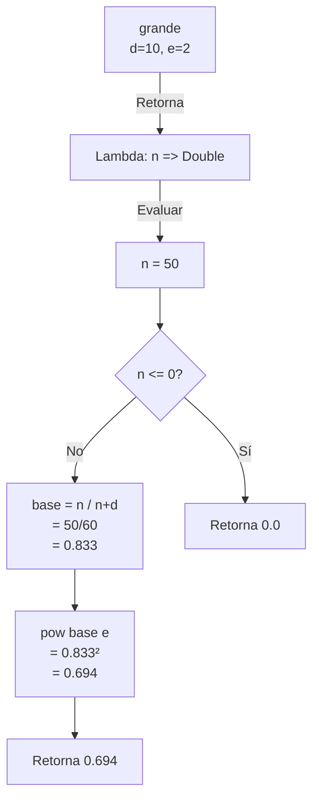

# 📘 Taller 2:  Programación Funcional y Concurrente
**Tema:** Ejercicios de programación: Conjuntos difusos

🗓️**Fecha:** Octubre de 2025

---
## 🧩 Introducción
### 🔢 Conjuntos difusos y lógica difusa
Los conjuntos difusos son una extensión de los conjuntos clásicos que permiten representar la pertenencia parcial de un elemento. A diferencia de los conjuntos 
tradicionales donde un elemento pertenece completamente (1) o no pertenece (0), en los conjuntos difusos un elemento puede tener un grado de pertenencia entre 0 y 1.

Este taller implementa `siete operaciones fundamentales` sobre conjuntos difusos:

1. **Pertenece**: Función que evalúa el grado de pertenencia de un elemento en un conjunto difuso
2. **Grande**: Función que determina qué tan "grande" es un número
3. **Complemento**: Operación que invierte los grados de pertenencia de un conjunto
4. **Union**: Operación que combina dos conjuntos difusos tomando el máximo
5. **Interseccion**: Operación que combina dos conjuntos tomando el mínimo
6. **Inclusion**: Relación que verifica si un conjunto está contenido en otro
7. **Igualdad**: Relación que verifica si dos conjuntos son idénticos

---
## ALGORITMOS
### 🔷 DEFINICIÓN FUNCIÓN "PERTENECE"


---
## ALGORITMOS
### 🔷 DEFINICIÓN FUNCIÓN "GRANDE"
La función `grande` crea un conjunto difuso que modela el concepto de "números grandes" mediante una función sigmoidal parametrizada. Utiliza la siguiente fórmula matemática:

Para un número $n$, su grado de pertenencia al conjunto de "números grandes" se define como:

$$
\text{grande}(n) =
\begin{cases}
0 & \text{si } n \leq 0 \\
\left(\frac{n}{n+d}\right)^e & \text{si } n > 0
\end{cases}
$$

Donde:
- $d$: Parámetro que controla la sensibilidad (valores más pequeños hacen que los números se consideren "grandes" más rápidamente).
- $e$: Exponente que controla la curvatura de la función.

#### Algoritmo en Scala:

```Scala
def grande(d: Int)(e: Int): ConjDifuso = {
    //belongsTo is the lambda to work with the number and make it
    // a ConjDiffuse
    val belongsTo = (n: Int) => {

      if (n <= 0) 0.0 //Statement to know when a number is negative

      else {

        val isItGreat = n.toDouble / (n.toDouble+d.toDouble)
        //Equation to know when a number is great
        math.pow(isItGreat, e)
        //To know if the number is great or not
      }
    }
    belongsTo
  }
```
**Componentes de la función:**
- `d: Int`: Primer parámetro que controla el desplazamiento horizontal de la curva.
- `e: Int`: Segundo parámetro que controla la pendiente (curvatura).
- `belongsTo`: Lambda que representa el conjunto difuso resultante.
- Retorna un `ConjDifuso` (función `Int => Double`)
- 
### 🔧 EXPLICACIÓN PASO A PASO
#### CASO BASE:
`if (n <= 0) 0.0`

Cuando $n$ es negativo o cero, el grado de pertenencia es 0, esto ya que un número no positivo o negativo no puede considerarse grande.

### CASO GENERAL:
```Scala
  else {
    val isItGreat = n.toDouble / (n.toDouble+d.toDouble)
    //Equation to know when a number is great
    math.pow(isItGreat, e)
    //To know if the number is great or not
  }
```
**Paso 1:** Calcular la fracción base

$$
\text{base} = \frac{n}{n+d}
$$

Esta fracción siempre está en el rango $(0, 1)$ para $n > 0$.

**Paso 2:** Elevar a la potencia $e$

$$
\text{grado} = \left(\frac{n}{n+d}\right)^e
$$

El exponente $e$ controla qué tan rápido crece el grado de pertenencia.

### 📝 EJEMPLO DE EJECUCIÓN DE `grande`
`val bigNumbers = grande(10)(2)`
**Evaluaciones:**

| Entrada | Cálculo | Resultado |
|---------|---------|-----------|
| `numGrandes(0)` | $0$ | $0.0$ |
| `numGrandes(10)` | $(10/(10+10))^2 = (0.5)^2$ | $0.25$ |
| `numGrandes(50)` | $(50/(50+10))^2 = (0.833)^2$ | $\approx 0.694$ |
| `numGrandes(100)` | $(100/(100+10))^2 = (0.909)^2$ | $\approx 0.826$ |

### 📊 DIAGRAMA DE EVALUACIÓN DE `grande(10)(2)`



---
## ALGORITMOS
### 🔷 DEFINICIÓN FUNCIÓN "COMPLEMENTO"


---
## ALGORITMOS
### 🔷 DEFINICIÓN FUNCIÓN "UNION"


---
## ALGORITMOS
### 🔷 DEFINICIÓN FUNCIÓN "INTERSECCIÓN"


---
## ALGORITMOS
### 🔷 DEFINICIÓN FUNCIÓN "INCLUSION"


---
## ALGORITMOS
### 🔷 DEFINICIÓN FUNCIÓN "IGUALDAD"


---